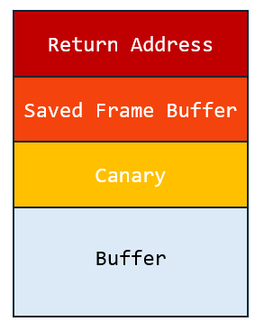
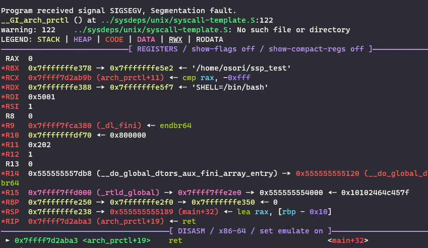
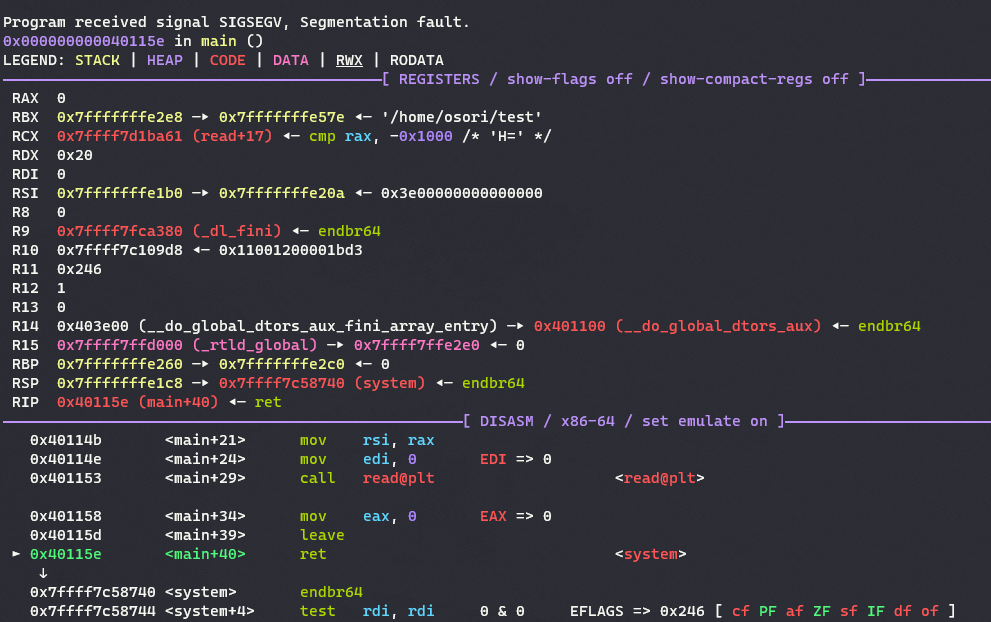
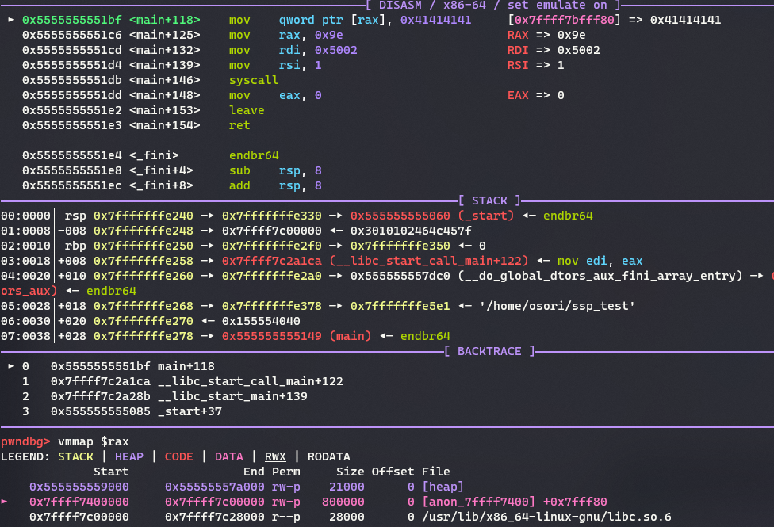
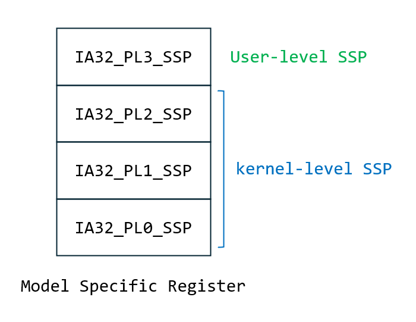
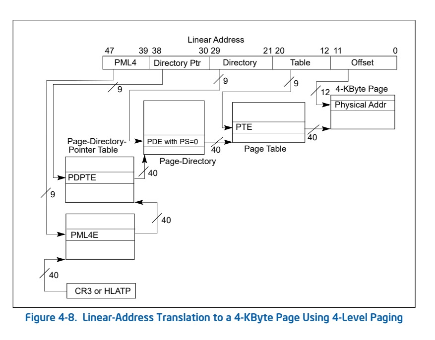
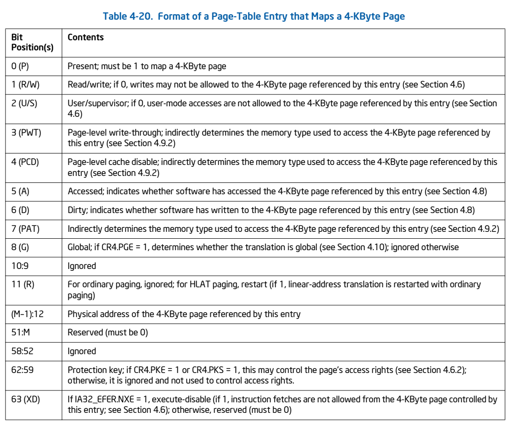
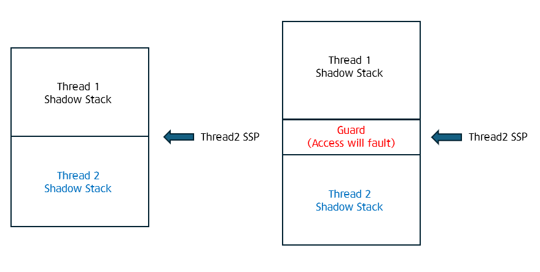

## 목차

1. Intel CET Shadow Stack in Linux Kernel
2. 배경지식
3. 현재의 익스플로잇 방법과 보호기법들
4. CET의 접근방식
5. Shadow Stack 사용하기
6. Shadow stack memory in x86
7. Shadow stack in linux kernel
8. 글을 마치며
9. 참고자료

---

## Intel CET Shadow Stack in Linux Kernel

안녕하세요! knights of the space의 멤버로 활동하고 있는 김영민(OSORI)입니다.  

저는 처음 보안에 입문할 때 시스템으로 시작해서 아직까지도 시스템 해킹을 주로 공부해오고 있습니다. 하지만 이제 저는 일자리를 잃을 수도 있을 것 같습니다.. 바로 Intel 의 Control-Flow Enforcement Technology(CET) 때문입니다. 이 기술하나로 ROP, JOP가 막혀버린다는데, 이번에 Ubuntu 24.04의 리눅스 커널에 도입되었다고 합니다. 본 포스팅에서는 CET 의 쉐도우 스택에 대해서 자세히 알아보도록 하겠습니다. 

---

## 배경지식

기본적인 시스템 해킹의 지식과 운영체제 지식(페이징) 알고계신 분들을 대상으로 글을 작성하였습니다. 운영체제에 관심있으신 분들이 보시면 좋을 것 같습니다. 

---

## 현재의 익스플로잇 방법과 보호기법들

현재의 시스템 해킹을 하시는 분들은 다들 아시겠지만, 대부분의 메모리 손상을 이용한 취약점 악용은 ROP(Return Oriented Programming) 기법을 이용해서 익스플로잇합니다. 이 기법은 메모리의 실행권한을 제어하는 NX bit 보호기법을 우회하기 위해서 등장했습니다. ROP는 프로그램의 실행권한이 있는 코드영역에 존재하는 유용한 (주로 ret으로 끝나는)코드조각들 통칭 ‘가젯’ 을 이용해서 원하는 코드를 실행하는 기법입니다. 또한 함수의 돌아갈 주소를 담고 있는 RET을 덮는 공격은 아직까지도 종종 가능할 때가 있습니다. 이 또한 위에서 언급한 ROP와 함께 사용되어 공격자는 RET을 덮을 수 있을 때 원하는 코드를 실행합니다. 

RET을 덮는 공격은 이미 너무나도 유명하기 때문에 대부분의 컴파일러에서는 스택 프로텍터(canary, stack cookie) 보호기법을 사용합니다. RET 앞에 랜덤한 값을 배치해 해당 값이 변조되면 프로그램을 종료시키는 것입니다. 완벽하지는 않지만 대부분의 상황에서 잘 동작하는 방법입니다. 하지만 그럼에도 불구하고 RET 자체가 변조될 때 프로그램의 흐름은 공격자에게 제어될 수 있습니다. 



윈도우에서는 CFG (Control Flow Guard) 라는 보호기법을 사용하기도 합니다. 주로 커널에 적용되어있는데 간접 호출(Indirect Branch) 방식으로 함수 포인터를 호출할 때 해당 함수 포인터의 변조 여부를 확인하여 공격자에게 프로그램의 흐름이 넘어가는 것을 방어합니다. 이 외에도 LLVM CFI 등 소프트웨어적으로 ROP를 막기위한 몇가지 대책들이 존재해왔습니다. 그러나 이 보호기법들은 이미 다양한 우회기법들이 알려져 있기도 합니다. 

그러나 위에서 언급한 CFG, CFI 같은 기법들은 소프트웨어적 기법이기 때문에 성능적인 오버헤드가 필연적으로 발생할 수 밖에 없고, 개발자가 따로 활성화를 시켜주어야 하기 때문에 호환성 측면에서 좋지는 않습니다. 그러나 CET는 하드웨어 보호기법이기 때문에 성능적인 오버헤드가 거의 없고, 큰 호환성 문제가 발생하지 않는다는 점에서 훨씬 우월하다고 볼 수 있습니다. 단점은 OS 개발자들이 힘들어진다는거겠네요. 

---

## CET의 접근방식

CET는 크게 2가지 방법으로 취약점을 방지합니다. 

- Shadow stack (shstk)
- Indirect branch tracking (IBT)

쉐도우스택은 또 다른 스택입니다. SSP(Shadow Stack Pointer) 라는 숨겨진 레지스터를 통해서 관리됩니다. 리턴 어드레스 변조를 통한 흐름 제어를 방어하는 기술로 CALL 명령어가 실행될 때 쉐도우 스택에도 리턴 어드레스를 저장하고, RET 으로 다시 호출 지점으로 복귀할 때 실제 스택과 쉐도우 스택의 값을 비교하여 복귀 주소가 같지 않다면 예외(#CP)를 발생시킵니다. 페이징 메모리 기법을 사용할 때만 사용이 가능합니다. 

IBT 는 간접 호출 (런타임에 호출 주소가 정해지는 방식 ex: call rax) 시에 점프 하는 곳의 명령어가 endbr32/64 로 시작하는지 확인합니다. CET를 지원하지 않는 CPU에서 endbr 명령어는 NOP으로 취급되기 때문에 프로그램의 호환성을 유지할 수 있습니다. 

사실 시스템 해킹을 하는 입장에서 치명적인 것은 IBT 입니다. 함수포인터, vtable 덮어쓰기로 가젯을 사용했는데 대부분의 가젯들은 endbr 명령어로 시작하지 않을테니까요. endbr 명령어는 컴파일러가 컴파일시에 자동으로 유효한 곳(함수의 시작 같은)에 넣어주기 때문에, 정상적이지 않은 어셈블리 명령어를 사용하는 가젯들을 사용할 수 없습니다. 윈도우의 CFG 는 그래도 우회가 가능한 조건이 있었지만, IBT 하나로 인해서 익스플로잇이 많이 힘들어졌습니다. 아직 IBT는 유저 프로그램에 대해서는 지원하지 않습니다. 쉐도우 스택의 경우 기존에 존재했던 stack protector 와 보완되면서 사용된다고 보셔도 좋을 것 같네요. 단, 이 쉐도우 스택의 존재로 인해서 SROP(Sigreturn ROP)는 불가능하게 되었습니다. 

그러나 IBT는 아직 지원이 많이 미비하기 때문에 쉐도우 스택에 대해서 중점을 두고 공부를 해보도록 하겠습니다! 

---

## Shadow Stack 사용하기

아래처럼 lscpu 명령어를 통해서 플래그를 확인 했을 때 쉐도우 스택이 사용가능한 것을 볼 수 있습니다. 


CET의 경우 ELF 파일에 특정한 문구가 마킹되있어야지 유저영역 어플리케이션에 활성화 됩니다. 아래와 같은 명령어로 확인결과 IBT, SHSTK 둘다 사용이 가능한 것을 볼 수 있습니다. 이는 컴파일러, 링커의 옵션을 통해서 마킹이 가능합니다. 

```cpp
readelf -n ssp_test | grep -a SHSTK
    Properties: x86 feature: IBT, SHSTK
```

리눅스 커널은 자동으로 CET를 활성화 시키지 않습니다. CET의 활성화는 로더의 몫입니다. GLIBC 로더의 CET는 기본적으로 호환성을 위해서 비활성화 되있지만(브라우저처럼 JIT 컴파일을 이용하고, 자기 자신만의 콜스택을 사용하는 프로그램들과 호환성 문제가 있습니다) 아래와 같은 환경변수로 쉐도우 스택을 활성화 시킬 수 있습니다. 일단은 이 환경변수는 활성화시키지 않도록 하겠습니다. 

```cpp
export GLIBC_TUNABLES=glibc.cpu.hwcaps=SHSTK
```

쉐도우 스택이 활성화 될 경우 아래 명령어로 프로세스의 상태를 읽어왔을 때 적용 상태를 알 수 있습니다. 

```cpp
cat /proc/pid/status | grep x86_Thread
x86_Thread_features: shstk wrss
x86_Thread_features_locked: shstk wrss
```

쉐도우 스택은 스레드 별로 동작하도록 고안되었습니다. 만약 쉐도우 스택을 사용하는 스레드가 다른 스레드를 만들면(리눅스는 clone 시스템콜을 사용해서 스레드를 만듭니다) 그 스레드 또한 쉐도우 스택을 사용합니다. 아래는 리눅스에서 유저영역 쉐도우 스택의 몇가지 특성입니다.

- 쉐도우 스택은 스레드 별로 할당됩니다. 스레드가 종료될 시 해당 스레드의 쉐도우 스택의 매핑이 해제됩니다. 쉐도우 스택의 할당 주소는 ASLR의 영향을 받습니다.
- 쉐도우 스택의 할당을 위한 새로운 시스템콜인 `map_shadow_stack` 이 추가되었습니다.
- fork 된 경우에도 쉐도우 스택은 계속 유지됩니다.
- 쉐도우 스택에 일반적인 명령어로 값을 쓰는 것은 허용되지 않습니다. `wrss`, `wruss` 명령어를 사용해야 하며 `wrss` 는 유저영역에서 사용 가능하나, 커널이 허용을 해주어야 합니다.
- execve 같은 시스템 콜을 쓸 경우 쉐도우 스택은 비활성화 됩니다.

유저 프로그램에서 쉐도우 스택을 사용하기 위해서는 `arch_prctl` 시스템 콜을 사용해야 합니다. 아래는 몇가지 예제입니다. 

```cpp
arch_prctl(ARCH_SHSTK_ENABLE, ARCH_SHSTK_SHSTK);
arch_prctl(ARCH_SHSTK_ENABLE, ARCH_SHSTK_WRSS);
arch_prctl(ARCH_SHSTK_LOCK, ARCH_SHSTK_SHSTK);
arch_prctl(ARCH_SHSTK_LOCK, ARCH_SHSTK_WRSS);이
```

`ARCH_SHSTK_ENABLE` 를 통해서 특정 기능들을 활성화 해줄 수 있고, `ARCH_SHSTK_LOCK` 를 통해서 기능의 비활성화를 잠글 수 있습니다. 악의적인 공격자가 쉐도우 스택을 비활성화 하는 것을 막는 기능입니다. `ARCH_SHSTK_SHSTK` 은 쉐도우 스택을, `ARCH_SHSTK_WRSS` 는 wrss 명령어의 허용 여부를 의미합니다. 기본적으로 GLIBC 로더는 쉐도우 스택이 활성화 되었을 때, shstk 을 활성화 시키고 shstk, wrss 의 변경을 잠굼으로서 공격자가 쉐도우 스택을 비활성화 하는 것을 막습니다. 

간단한 프로그램으로 쉐도우 스택을 테스트 해보겠습니다. 기본적인 버퍼오버플로우 취약점이 발생하는 코드입니다. 

```cpp
//gcc -o ssp_test ssp_test.c -fno-stack-protector
#include <stdio.h>
int main(){
        char buf[0x10];
        read(0, buf, 0x100);
}
```

직접 쉐도우 스택을 사용하기 위해서 `arch_prctl` 함수를 이용하겠습니다. man page 에는 구현된 wrapper 가 없다고 하지만, 실제로는 존재합니다. 

```cpp
//gcc -o ssp_test ssp_test.c -fno-stack-protector
#include <stdio.h>
#include <unistd.h>
#include <sys/syscall.h>
#include <asm/prctl.h>
int main(){
        arch_prctl(ARCH_SHSTK_ENABLE, ARCH_SHSTK_SHSTK);
        char buf[0x10];
        read(0, buf, 0x100);
}
```

이 프로그램을 컴파일 하고 실행해봅니다.  입력값을 받지 못하고 SIGSEGV 시그널을 받았습니다. 

```cpp
osori@osori-vm:~$ ./ssp_test
Segmentation fault (core dumped)
```

디버깅을 하면 아래처럼 나옵니다.



쉐도우 스택의 활성화 여부를 보면 잘 활성화 되있는 것을 볼 수 있습니다.

```bash
osori@osori-vm:~$ cat /proc/$(pgrep ssp_test)/status | grep x86_Thread
x86_Thread_features:    shstk
x86_Thread_features_locked:
```

`arch_prctl` 시스템콜로 쉐도우 스택이 활성화 된 직후 SSP는 쉐도우 스택의 최상단에 위치합니다. 여기서 ret 명령어를 만날 경우 스택 언더플로우가 일어나게 됩니다. 왜냐하면 `arch_prctl` 의 wrapper 함수로 진입할 때 스택에 기록한 return address는 쉐도우 스택의 활성화 이전에 적혔기 때문입니다.  **쉐도우 스택은 쉐도우 스택 메모리에만 접근이 가능합니다**. 일반 페이지는 접근이 불가능 합니다. 그렇기 때문에 SIGSEGV 시그널을 받게 된 것입니다.

그래서 그냥 인라인 어셈블리를 사용해주었습니다. 0x5001 는`ARCH_SHSTK_ENABLE` 값입니다. 

```cpp
//gcc -o ssp_test ssp_test.c -fno-stack-protector -masm=intel
#include <stdio.h>
#include <unistd.h>
#include <sys/syscall.h>
#include <asm/prctl.h>

void vuln(){
        char buf[0x10];
        read(0, &buf, 0x30);
}

int main(){
        asm("mov rax, 0x9e;");
        asm("mov rdi, 0x5001;"); //enable shadow stack
        asm("mov rsi, 1;");
        asm("syscall;");
        vuln();
        exit(0);
}
```

`vuln` 함수에만 쉐도우 스택을 적용하였습니다. GDB를 이용해서 return address 를 system 으로 변조해보았는데 SIGSEGV 가 발생한 것을 볼 수 있습니다. 



이제 한번 쉐도우 스택을 읽고 써보겠습니다. `_get_ssp` 함수는 `rdsspq` 명령어의 intrinsic 입니다. 

```cpp
//gcc -o ssp_test ssp_test.c -masm=intel -fno-stack-protector -march=native
#include <stdio.h>
#include <unistd.h>
#include <sys/syscall.h>
#include <asm/prctl.h>
#include <signal.h>
#include <immintrin.h>

int main(){	
	asm("mov rax, 0x9e;");
	asm("mov rdi, 0x5001;"); //enable shadow stack
	asm("mov rsi, 1;");
	asm("syscall;");
	unsigned long* ssp = _get_ssp();
	printf("ssp : %p\n", ssp);
	printf("ssp ref : %llx\n", *(ssp - 0x10));
	*(ssp - 0x10) = 0x41414141;
	exit(0);
}

```

결과는 아래와 같습니다. 쉐도우 스택을 읽는 것은 문제가 없었지만, 값을 쓸려고 하자 SIGSEGV 가 발생합니다. 

```cpp
ssp : 0x748e0a200000
ssp ref : 0
Segmentation fault (core dumped)
```



재밌게도 쉐도우 스택으로 매핑된 메모리 맵은 rw 로 보입니다. 쉐도우 스택 영역 주소는 일반적인 명령어로 값을 쓰는 것이 불가능하기 때문에 이런일이 발생했습니다. 쉐도우 스택 메모리에 값을 쓰기 위해서는 `wrss` 명령어를 이용해야 합니다. 

자 그러면 이제 유저입장이 아니라 운영체제와 CPU의 입장에서는 어떻게 해당 메모리가 쉐도우 스택으로 매핑된 공간인지 알 수 있을까요? 그리고 왜 쉐도우 스택 메모리는 RO 가 아니라 RW 로 권한이 설정되있는걸까요? 

---

## Shadow stack memory in x86

쉐도우 스택의 실체는 어디에 존재할까요? 쉐도우 스택이 실질적으로 저장되는 레지스터는 Model Specific Register 줄여서 MSR 이라고 부르는 곳입니다. 아래 그림처럼 특권 레벨 0(커널)~ 3(유저)에 따른 단계별로 쉐도우 스택 레지스터가 존재합니다. 



이 MSR 을 바꾸기 위해서는 `wrmsr` 이라는 명령어를 사용해야 하지만, 해당 명령어는 커널 레벨의 권한을 요구하는 명령어이기 때문에 유저가 직접적으로 쉐도우 스택을 설정하는 것은 불가능합니다.  그리고 쉐도우 스택은 PL0 ~ PL2 사이에 발생하는 CALL/RET 에는 쉐도우 스택을 검증하는 루틴이 있지만, PL012 ↔ PL3 간에 발생하는 CALL/RET(예 : syscall) 에는 검증을 하지 않습니다. 유저 ↔ 커널 간에 데이터가 공유되는 것은 보안에 치명적이기 때문입니다. 커널이 유저의 쉐도우 스택에 접근 하는 것도 허용되지 않고(SMAP 보호기법), 유저가 커널의 쉐도우 스택에 접근하는 것도 허용되지 않습니다. 

이제 쉐도우 스택의 메모리 구조를 보도록 하겠습니다. 쉐도우 스택 메모리가 어떻게 구현되는지 알기 위해서는 x86 아키텍쳐의 페이징에 대해서 알아야 합니다. 리눅스는 4kb 단위의 페이징을 사용하며 그 구조는 아래와 같습니다. 



아래는 Page Table Entry(PTE) 구조체 테이블입니다. 



재밌는 점은 쉐도우 스택 메모리임을 따로 나타내는 비트는 없습니다. 메모리 권한과 관련된 비트는 R/W, U/S 만 존재합니다. 이미 정해진 구조체를 변화시킬 경우, 많은 문제가 생길 수 있기 때문에 인텔의 엔지니어들은 재미있는 생각을 하게됩니다. 바로 Dirty flag를 이용하는 것입니다. Dirty flag 는 해당 페이지에 값을 적을 경우 자동으로 비트가 세팅되는 비트입니다. R/W 를 0, Dirty 를 1로 세팅하면 쓰기 권한이 없는데 값이 써졌다는 모순이 발생하게 되고, 이런일은 일반적인 시나리오에서는 존재하지 않습니다. CPU는 이를 이용해서 페이지가 쉐도우 스택 페이지인지 확인합니다. 

그리고 위에서 언급했던 프로그램별 호환성 문제가 존재합니다. 예를들어서 프로그램이 자기 자신의 콜스택을 관리하는 경우가 있겠습니다. 이를 위해서 몇가지 유저가 사용 가능한 명령어를 제공합니다. 

`INCSSP` : 쉐도우 스택 포인터를 지정한 만큼 증가시킵니다. 

`RDSSP` : 쉐도우 스택 포인터를 읽습니다.

`WRSS` : 지정한 쉐도우 스택 주소에 값을 적습니다. 

`SAVEPREVSSP`, `RSTORSSP` 쉐도우 스택 컨텍스트를 저장/복구 하기 위해서 사용됩니다. 

이 외에도 `WRUSS`, `SETSSBSY`, `CLRSSBSY` 명령어가 존재하지만 커널 레벨에서  사용 가능한 명령어입니다. 

---

## Shadow stack in linux kernel

왜 리눅스에서 쉐도우 스택 메모리가 RW로 설정되있는지에 대해서 알려면 리눅스의 메모리 관리 방법을 알아야합니다. 리눅스는 Virtual Memory Area(vma) 를 이용해서 가상메모리를 관리합니다. 이 구조체에는 메모리의 주소, 크기, 권한 등이 저장됩니다. 

```cpp
struct vm_area_struct {
	/* The first cache line has the info for VMA tree walking. */

	union {
		struct {
			/* VMA covers [vm_start; vm_end) addresses within mm */
			unsigned long vm_start;
			unsigned long vm_end;
		};
#ifdef CONFIG_PER_VMA_LOCK
		struct rcu_head vm_rcu;	/* Used for deferred freeing. */
#endif
	};

	struct mm_struct *vm_mm;	/* The address space we belong to. */
	pgprot_t vm_page_prot;          /* Access permissions of this VMA. */

	/*
	 * Flags, see mm.h.
	 * To modify use vm_flags_{init|reset|set|clear|mod} functions.
	 */
	union {
		const vm_flags_t vm_flags;
		vm_flags_t __private __vm_flags;
	};
...
```

물론 이는 소프트웨어적인 자료형이기 때문에, `mov` 명령어로 값을 옮길 때 vma 구조체를 확인해서 rw 영역인지를 확인할 수는 없습니다. 그러나 만약 메모리의 권한이 RO라서 페이지 폴트가 발생하면 흐름이 커널에게 돌아가기 때문에 vma 구조체를 참조할 수 있습니다. Copy on Write(CoW) 페이지도 비슷한 흐름으로 관리됩니다. 실제 CPU가 인식하는 메모리 권한은 RO로 세팅하되, vma에는 CoW 마킹을 해놓는 것이죠. 그러면 Write 가 발생할 때 해당 메모리 권한은 RO이기 때문에 페이지 폴트가 발생하고 커널은 CoW를 확인하고 새로 메모리를 할당하고 복사하여 프로세스에게 반환하는 형식입니다. 즉 우리에게 보이는 가상메모리 권한은 실제 메모리 권한과 다를 수 있습니다.  

아래는 리눅스 커널에서 쉐도우 스택을 할당하는 코드입니다. `do_mmap` 함수를 이용해서 메모리를 할당하는 것을 볼 수 있습니다. 그리고 `VM_SHADOW_STACK`, `VM_WRITE` 두개의 권한을 주고 있습니다. 이 때문에 우리에게는 RW 권한이 있다고 보이는 것이죠. 일반적인 `mmap` 함수와 같이 메모리가 할당되기 때문에, 쉐도우 스택을 유저 프로세스가 어느정도 제어가 가능하다는 점을 염두해야 합니다.

```cpp
static unsigned long alloc_shstk(unsigned long addr, unsigned long size,
				 unsigned long token_offset, bool set_res_tok)
{
	int flags = MAP_ANONYMOUS | MAP_PRIVATE | MAP_ABOVE4G;
	struct mm_struct *mm = current->mm;
	unsigned long mapped_addr, unused;

	if (addr)
		flags |= MAP_FIXED_NOREPLACE;

	mmap_write_lock(mm);
	mapped_addr = do_mmap(NULL, addr, size, PROT_READ, flags,
			      VM_SHADOW_STACK | VM_WRITE, 0, &unused, NULL);
	mmap_write_unlock(mm);

	if (!set_res_tok || IS_ERR_VALUE(mapped_addr))
		goto out;

	if (create_rstor_token(mapped_addr + token_offset, NULL)) {
		vm_munmap(mapped_addr, size);
		return -EINVAL;
	}

out:
	return mapped_addr;
}
```

리눅스 커널의 쉐도우 스택과 관련된 패치들을 읽어보면서 저는 재미있는 내용들을 발견할 수 있었습니다. 먼저 리눅스 커널 개발자들이 쉐도우 스택을 구현하기 위해서 고려한 사항들입니다. 

### 기존 페이지 권한

**리눅스 커널에서는 이미 Dirty = 1, R/W 를 0 인 페이지를 CoW 페이지**로 이용하고 있었습니다. 그리고 R/W 비트가 0이기 때문에 우리는 평범한 mov 같은 명령어로 쉐도우 스택에 데이터를 저장할 수가 없는 것입니다. 물론 읽는 것은 가능합니다. 이는 커널이 쉐도우 스택 페이지를 의도치 않게 만들 수 있는 것을 의미하기 때문에, 기존 커널코드와의 호환성을 유지하기 위해서 기존 PTE 에서 무시되는 10 번째 비트를 활용하여 Dirty bit 를 10번째 비트로 옮겨서 저장합니다. 읽을 때는 다시 연산을 통해서 Dirty bit를 복구합니다. 아래는 새로 추가된 코드입니다. 이 외에도 쉐도우 스택 메모리가 의도치 않게 만들어지는 것을 막기 위한 코드가 여러곳에 추가되었습니다. 

```cpp
static inline pgprotval_t mksaveddirty_shift(pgprotval_t v)
{
	pgprotval_t cond = (~v >> _PAGE_BIT_RW) & 1;

	v |= ((v >> _PAGE_BIT_DIRTY) & cond) << _PAGE_BIT_SAVED_DIRTY;
	v &= ~(cond << _PAGE_BIT_DIRTY);

	return v;
}

static inline pgprotval_t clear_saveddirty_shift(pgprotval_t v)
{
	pgprotval_t cond = (v >> _PAGE_BIT_RW) & 1;

	v |= ((v >> _PAGE_BIT_SAVED_DIRTY) & cond) << _PAGE_BIT_DIRTY;
	v &= ~(cond << _PAGE_BIT_SAVED_DIRTY);
	return v;
}
```

### 가상 메모리 권한

쉐도우 스택의 vma 에 권한 설정에 대한 많은 의견이 오고 갔습니다. 쉐도우 스택의 메모리 자체가  **쓰기 가능하지만, 평범하게는 쓸 수 없는 메모리**라는 점에서 특별하기 때문입니다. 리눅스 커널은 쉐도우 스택 자체를 특별한 ‘쓰기 가능한’ 메모리로 취급합니다. 논리적으로 쓰기가 가능하지만, PTE 의 R/W 비트는 항상 0이여야 합니다. 따라서 유저 영역에서는 rw 메모리로 매핑되어 보입니다. 

### 가드페이지

쉐도우 스택은 추가적으로 가드페이지를(0x1000) 할당 받습니다. `incssp` 명령어로 최대로 옮길 수 있는 쉐도우 스택 포인터의 최대 크기가 2040바이트이기 때문에 0x1000 크기의 페이지로 인접한 쉐도우 스택에서 SSP 가 이동하는 것을 막을 수 있습니다. 

아래 그림에서 왼쪽은 가드페이지가 없을때의 모습입니다. 인접한 쉐도우 스택끼리에서 SSP가 이동하게 된다면 보안 문제가 생길 수 있습니다. 그러나 가드페이지를 추가함으로서 페이지의 접근시에 페이지 폴트가 발생하고 프로그램은 종료될 것 입니다. 



### 이외에도 몇가지 주목할만한 점들

1. `setjmp`, `longjmp` 같이 컨텍스트를 바꾸는 함수들에 대한 처리
2. /proc/pid/mem 을 통해서 wrss 명령없이 쉐도우 스택에 값 쓰기 가능
3. 시그널 핸들러는 호출되는 스레드와 같은 쉐도우 스택 사용
4. 쉐도우 스택도 CoW 로 사용될 수 있다. Fork 의 경우가 대표적으로 자식 프로세스가 쉐도우 스택에 값을 적게 되면 CoW가 해제되고 (리눅스 커널에서는 break 라고 표현) 페이지가 생성되게 된다. 

---

## 글을 마치며

사실 이 글을 쓸때 좀 가벼운 마음으로 접근을 했는데, 정말 쉽지 않은 여정이였습니다. 특히 어떤 내용을 담아야 사람들이 흥미 있게 볼지도 좀 어려웠고, 자료가 없다보니 리눅스 커널에서 쉐도우 스택이 들어간 모든 코드를 봤던 것 같습니다. 

좀 더 관심이 있는 분들은 아래의 참고자료중 Complex Shadow-Stack Updates 문서를 확인해보시면 좋을 것 같습니다. 쉐도우 스택 검증과정 및 하이퍼바이저 및 OS 가 쉐도우 스택을 다룰 때 주의할 점들이 주 내용을 이루고 있는 문서입니다. 이 내용은 아쉽게도 저도 이해를 다 못하였고, 이 글에 다루기에는 너무 글이 길어지는 것 같아서 여기서 마치도록 하겠습니다. 다음에는 더 재밌는 주제로 찾아뵙도록 하겠습니다. 

---

## 참고자료

- Intel Control-flow Enforcement Technology Specification
- Complex Shadow-Stack Updates(Intel Control-Flow Enforcement Technology)
- Intel 64 and IA-32 Architectures Software Developer’s Manual
- [Enable intel CET in linuxOS](https://lpc.events/event/7/contributions/729/attachments/496/903/CET-LPC-2020.pdf)
- [Shadow stacks for userspace(LWN)](https://lwn.net/Articles/883340/)
- [Shadowstacks for userspace(LWN)](https://lwn.net/Articles/909885/)
- [Control-flow Enforcement Technology (CET) Shadow Stack(Linux Kernel)](https://docs.kernel.org/next/arch/x86/shstk.html?highlight=control+flow)
- Linux 6.8.9 Source code